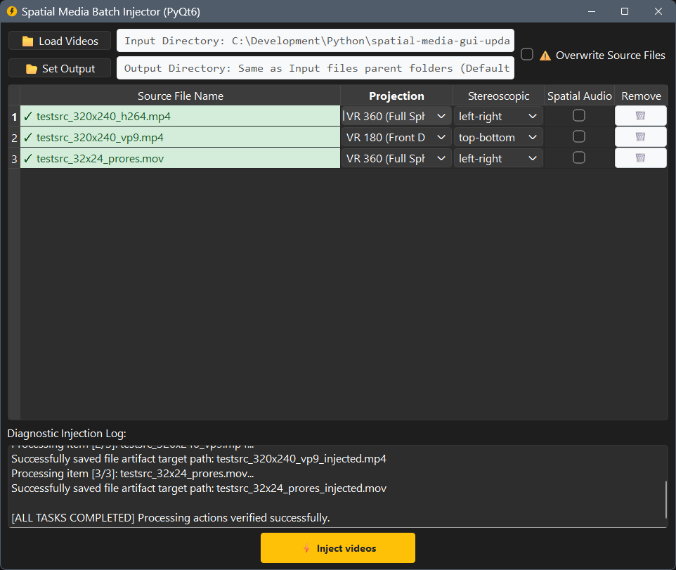

# Spatial Media Batch Injector (PyQt6 Update)

A modern, multi-threaded batch desktop application built to view, configure, and inject spatial media metadata into MP4 and MOV video containers. 

This repository replaces the abandoned 2016 command-line tool with a fully modernized, asynchronous user interface powered by **PyQt6**, supporting fluid **Drag & Drop** operations, file-by-file custom output paths, and hardened verification loops.

---
  <br>
  <p align="center">
    
    
  </p>

## 💾 Installation 

Pre-compiled standalone desktop binaries are provided:


1. Head over to the [**Latest Releases**](https://github.com/alejandronbachi/spatial-media-gui-update/releases) section on the right-hand panel of this repository.
2. Download the compressed executable package tailored to your operating system:
   * **Windows**: `SpatialMediaBatchInjector-Windows.zip` (Contains standalone `.exe`)
   * **macOS**: `SpatialMediaBatchInjector-macOS.dmg` (Native Apple Disk Image)
   * **Linux**: `SpatialMediaBatchInjector-Linux.AppImage` (Universal portable binary)
3. Extract the file and run it natively—no external environment setup required!

---

## 🛠️ Injection Settings

### Projection Environment
Determines the geometric coordinates the video player uses to wrap and render the video frame around the user. 
* **Flat / Standard Video**: Leaves the metadata untouched. The file acts like a standard flat movie screen display.
* **VR 360 (Full Spherical)**: Instructs the video player to project the entire canvas onto the inside of a virtual 360-degree ball, allowing for seamless panning in all directions (front, back, up, down).
* **VR 180 (Front Dome)**: Injects pixel bounding crop limits (`1:2:2:2:0:0`). This instructs the rendering engine to scale the video properties exactly onto a 180-degree front-facing dome shield. This preserves perfect 1:1 anatomical scale and stops objects from looking violently wide or distorted during playback.

### Stereoscopic Mode
Selects the left/right eye frame layout mapping to generate a true 3D depth perception effect. See the `StereoMode` element in the [Spherical Video RFC](docs/spherical-video-rfc.md) for more details.
* **`none`**: Monoscopic flat 2D presentation. Both lenses display an identical image frame.
* **`top-bottom`**: Over/Under configuration. The top half contains the left eye view, and the bottom half contains the right eye view.
* **`left-right`**: Side-by-Side (SBS) configuration. The left half contains the left eye view, and the right half contains the right eye view.

### Spatial Audio
Enables injection of spatial audio metadata. If enabled, the file must contain a 4-channel first-order ambisonics audio track with ACN channel ordering and SN3D normalization; see the [Spatial Audio RFC](docs/spatial-audio-rfc.md) for more information.

---

## 💡 Core Visual Concepts

### "Spherical" vs. "Stereoscopic" Configurations
To ensure an immersive video triggers correct playback configurations, you must map **two completely independent data questions** for the video player:
1. **The Projection Environment (Where do I look?):** *Is the video stretched onto a 360-degree ball, a 180-degree front dome, or left flat?* (Controlled by the Projection column).
2. **The Stereoscopic Depth (How do I see 3D?):** *Is the image flat 2D, or split side-by-side/top-bottom to create a true 3D depth perception filter?* (Controlled by the Stereoscopic column).

*If you get it wrong:* If you have a Side-by-Side video file and inject "VR 360" but leave Stereoscopic Mode as `none`, a video player like VLC will simply wrap the entire dual-panel screen all the way around the room. You will see two stretched, matching versions of the room next to each other rather than a single unified 3D environment!

### How to Tell if a Side-by-Side Video is 180 or 360?
Because both files display as two matching panels side-by-side on a flat computer monitor when un-injected, look closely at the shapes of the objects inside one of the panels to separate them:
* **It is VR 180 if:** The images inside the panels look like two circular, circular fish-eye bubbles with black empty space framing the outer edges, or if the geometric proportions look completely normal and tightly framed like a standard wide lens camera.
* **It is VR 360 if:** The images look violently distorted, warped, and unnaturally stretched out across the rectangle. For example, straight lines on a wall curve like a wave, and people standing near the edges look stretched out like cartoon characters. This indicates the lens squished a complete 360-degree room into a flat rectangular frame.

---

## 💻 Developer Guide & Local Compilation

If you wish to modify the source code, inspect core engine logic loops, or compile the project locally on your machine, follow these instructions.

### Running from Source
Make sure your system environment has Python 3.10+ installed. Install the dependencies and execute the primary system entry point:
```bash
pip install -r requirements.txt
python main.py
```

### Manual PyInstaller Builds
To manually compile an isolated, single-file desktop binary locally using your machine's operating system native compiler, execute:
```bash
pyinstaller main.spec
```
